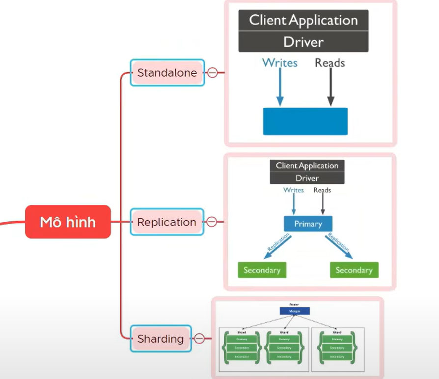
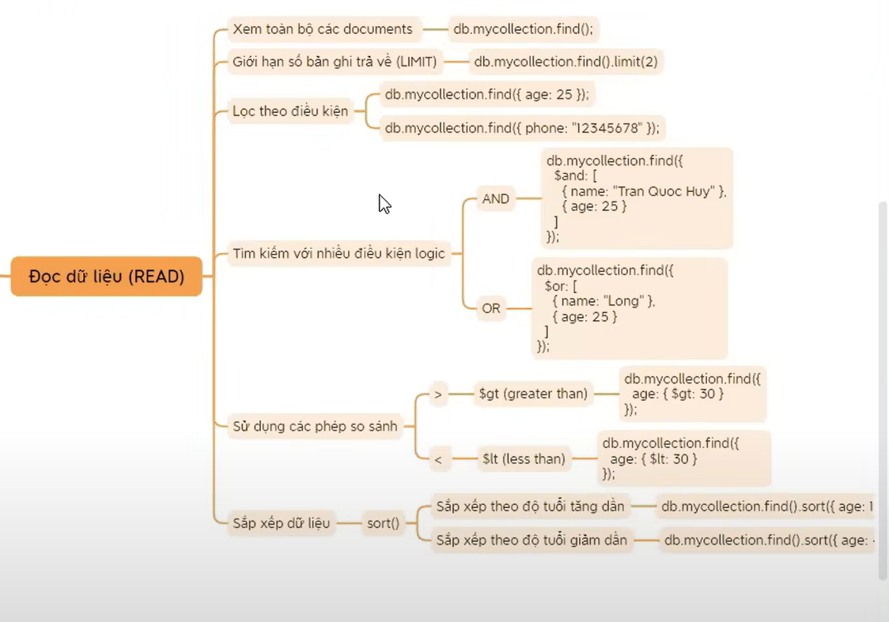
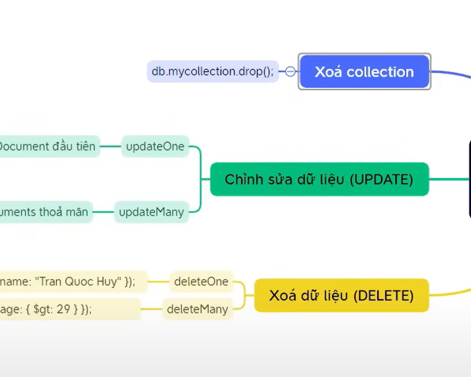
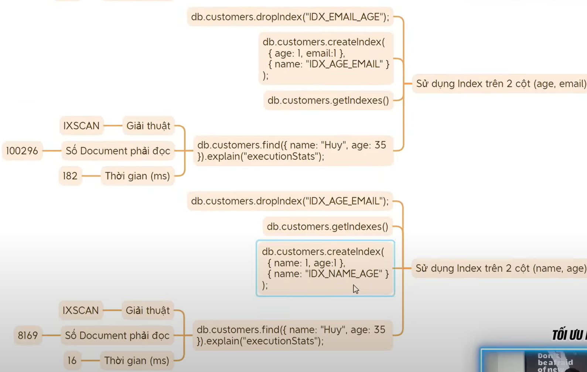

# Non-Relational Databases (NoSQL)

##### ✅ Q1: ?

| Tiêu chí              | SQL                                        | NoSQL                                        |
| --------------------- | ------------------------------------------ | -------------------------------------------- |
| **Kiểu dữ liệu**      | Quan hệ, bảng                              | Document, key-value, graph, wide-column      |
| **Schema**            | Cố định (phải định nghĩa trước)            | Không cần cố định, linh hoạt                 |
| **Quan hệ dữ liệu**   | Rất mạnh (JOIN, FK)                        | Hạn chế JOIN, thường denormalization         |
| **ACID**              | Hỗ trợ rất tốt                             | Tuỳ hệ thống (MongoDB mới có ACID)           |
| **Khả năng Scale**    | Vertical scale (tăng RAM/CPU)              | Horizontal scale (thêm node)                 |
| **Hiệu năng đọc/ghi** | Ổn định, nhưng chậm khi dữ liệu quá lớn    | Rất nhanh, đặc biệt là Redis, Cassandra      |
| **Query**             | Mạnh mẽ, SQL ngắn gọn                      | Mỗi DB có cách query riêng, đôi khi phức tạp |
| **Use cases**         | ERP, banking, e-commerce, quản lý đơn hàng | Realtime, caching, logging, analytics, IoT   |

Đánh index trên nhiều cột, chú ý cột đầu tiên và thứ tự các cột
giải thuật: COLLSCAN (quét ful)
INXSCAN (index)

***
