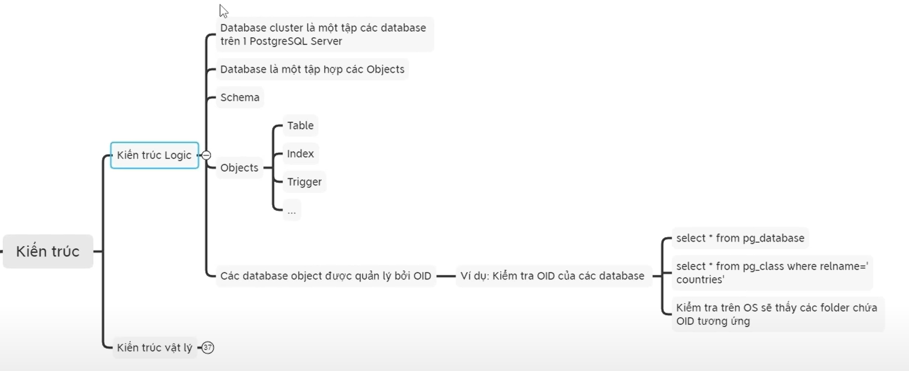
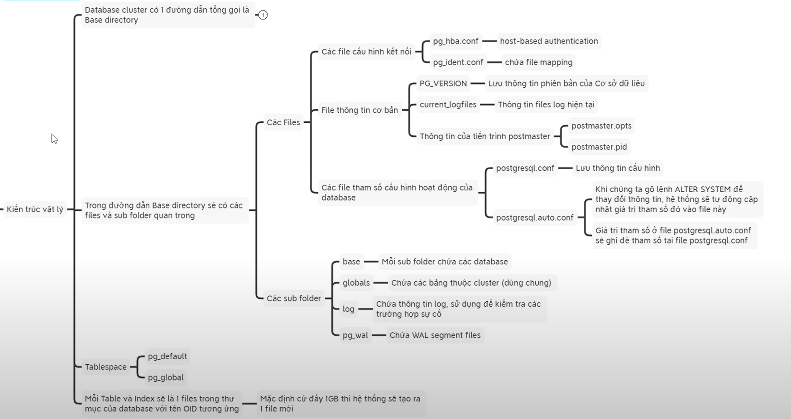
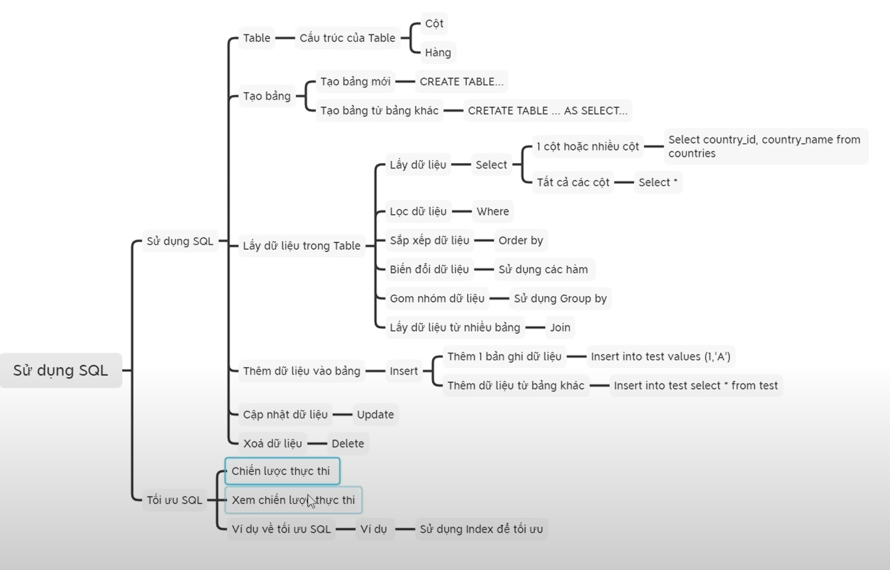
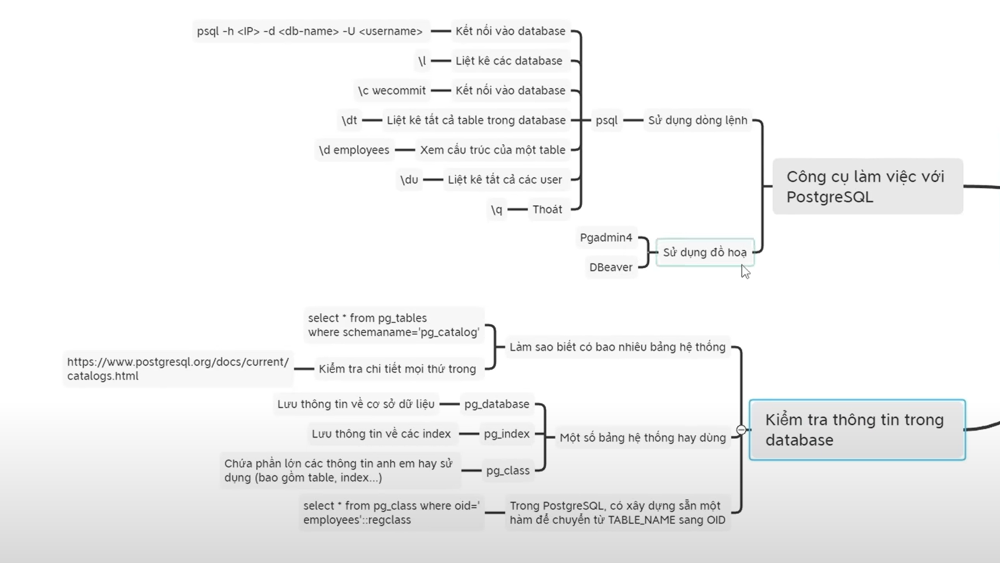
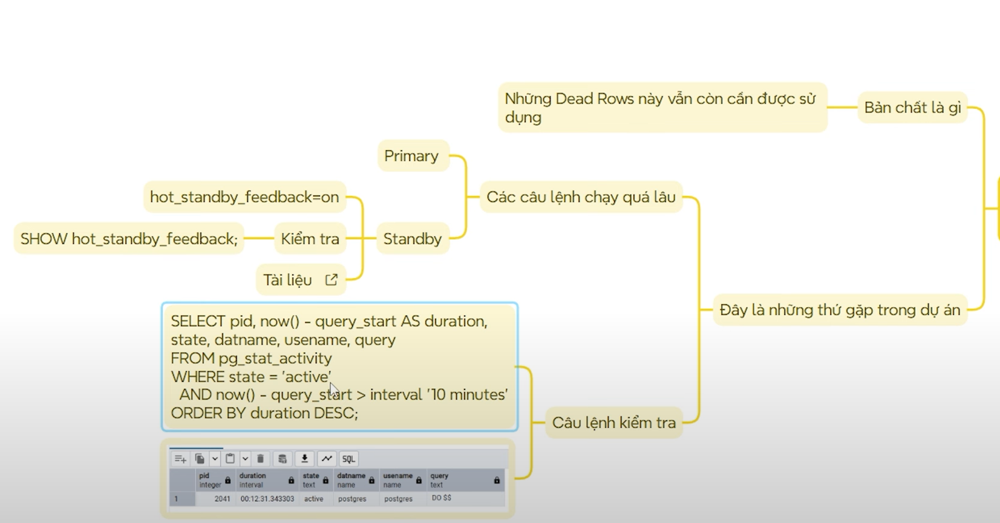
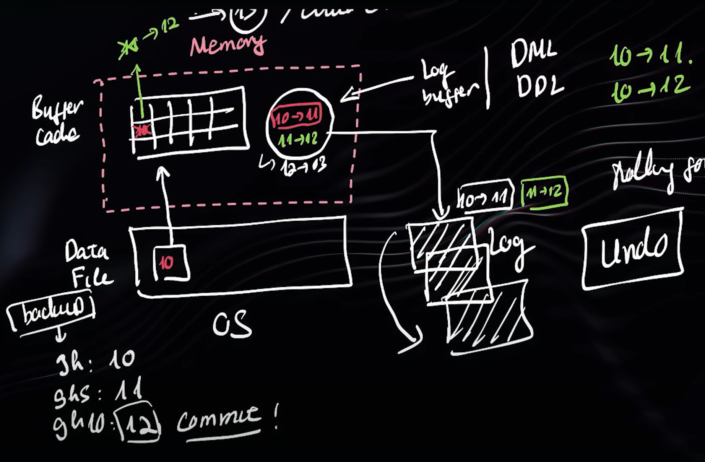
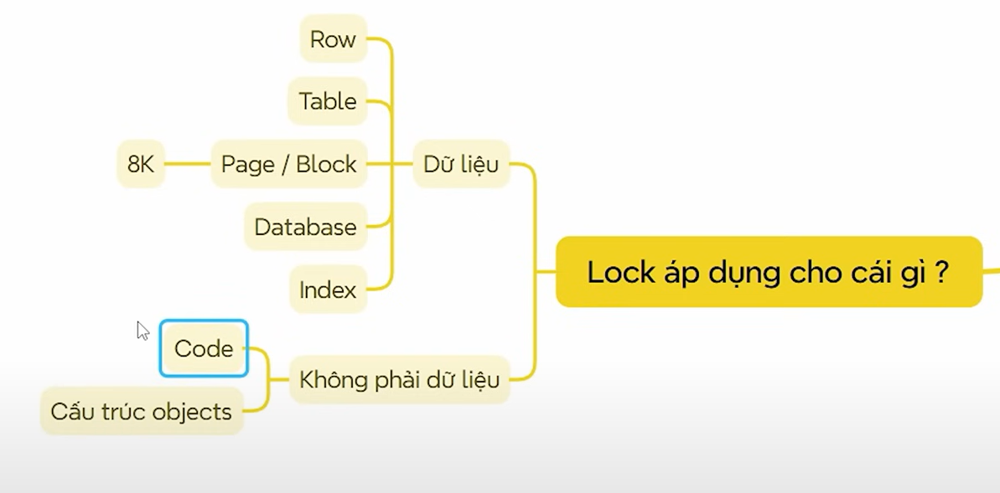
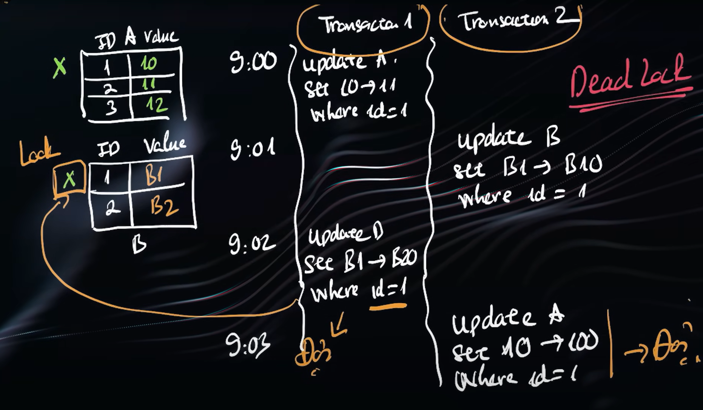
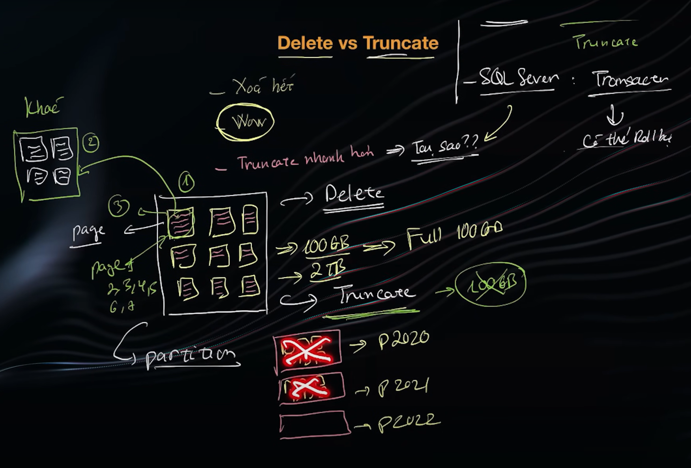
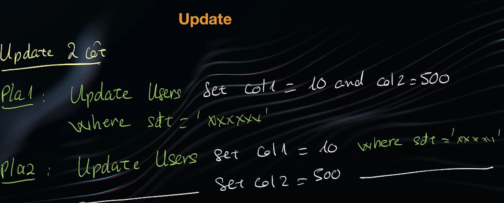

# Relational Databases (SQL)

##### ✅ Q1: What is PRIMARY KEY? — Khóa chính là gì?

Trả lời:
Primary Key (khóa chính) là một hoặc nhiều cột dùng để định danh duy nhất mỗi dòng trong bảng.
Đặc điểm:

* Không được trùng lặp.
* Không được NULL.
* Có thể là 1 hoặc nhiều cột (Composite Key).

```sql
CREATE TABLE staff (
    staff_id SERIAL PRIMARY KEY,
    name VARCHAR(100)
);
```

***

##### ✅ Q2: Define a Temp Table — Bảng tạm là gì?

Trả lời:
Temp Table (bảng tạm) là bảng chỉ tồn tại trong phiên làm việc hiện tại, được dùng lưu dữ liệu tạm thời.

```sql
CREATE TEMP TABLE temp_orders (
    order_id INT,
    amount NUMERIC(10,2)
);
```

***

##### ✅ Q3: What is a VIEW? — VIEW là gì?

Trả lời:
View là bảng ảo, được tạo từ câu SELECT.
Nó không lưu dữ liệu thật, mà lấy dữ liệu từ các bảng gốc mỗi khi được truy vấn.

Dùng để:

* Bảo mật dữ liệu.
* Viết truy vấn phức tạp một lần.
* Tái sử dụng.

```sql
CREATE VIEW active_orders AS
SELECT id, customer, status
FROM orders
WHERE status = 'ACTIVE';
```

***

##### ✅ Q4: What is DEFAULT? — DEFAULT là gì?

DEFAULT là giá trị mặc định cho cột nếu không truyền giá trị.

```sql
CREATE TABLE accounts (
    id SERIAL PRIMARY KEY,
    status VARCHAR(10) DEFAULT 'ACTIVE',
    created_at TIMESTAMP DEFAULT NOW()
);
```

***

##### ✅ Q5: DDL vs DML — Khác nhau giữa DDL và DML

DDL (Data Definition Language)
Tạo/thay đổi cấu trúc bảng.

```sql
ALTER TABLE orders ADD COLUMN note TEXT;
```

DML (Data Manipulation Language)
Thao tác dữ liệu.

```sql
UPDATE orders SET status = 'DONE' WHERE id = 10;
```

***

##### ✅ Q6: TRUNCATE vs DELETE (PostgreSQL)

| DELETE                                  | TRUNCATE                   |
| --------------------------------------- | -------------------------- |
| Xóa theo điều kiện                      | Xóa toàn bộ bảng           |
| Ghi log từng dòng                       | Ghi log tối thiểu          |
| Chậm hơn                                | Nhanh hơn                  |
| Có thể ROLLBACK (nếu trong transaction) | Không rollback trong MySQL |
| Không reset AUTO_INCREMENT              | Reset AUTO_INCREMENT       |

```sql
DELETE FROM logs WHERE created_at < NOW() - INTERVAL '30 days';
TRUNCATE TABLE logs RESTART IDENTITY;
```

***

##### ✅ Q7: What is FOREIGN KEY? — Khóa ngoại là gì?

Foreign Key (khóa ngoại) là cột liên kết đến Primary Key của bảng khác, dùng để:

* Tạo quan hệ giữa các bảng.
* Đảm bảo toàn vẹn dữ liệu.

```sql
CREATE TABLE department (
    id SERIAL PRIMARY KEY,
    name VARCHAR(100)
);

CREATE TABLE staff (
    id SERIAL PRIMARY KEY,
    name VARCHAR(100),
    department_id INT REFERENCES department(id)
);
```

***

##### ✅ Q8: What is Normalization? — Chuẩn hóa dữ liệu

Normalization là quá trình tổ chức dữ liệu thành các bảng nhỏ hơn để:

* Tránh dư thừa dữ liệu.
* Tránh cập nhật sai.
* Tăng tính nhất quán.

Các dạng: 1NF, 2NF, 3NF, BCNF.

```sql
CREATE TABLE customer (
    id SERIAL PRIMARY KEY,
    name VARCHAR(100),
    phone VARCHAR(15)
);

CREATE TABLE orders (
    id SERIAL PRIMARY KEY,
    customer_id INT REFERENCES customer(id),
    total NUMERIC
);
```

***

##### ✅ Q9: What is Denormalization? — Phi chuẩn hóa

Denormalization là quá trình gộp các bảng lại để:

* Giảm số lượng JOIN.
* Tăng tốc truy vấn đọc.

Đánh đổi: tăng dư thừa dữ liệu → tốn bộ nhớ.

```sql
CREATE TABLE address (
    id SERIAL PRIMARY KEY,
    full_address TEXT,
    province_name VARCHAR(100),
    district_name VARCHAR(100),
    ward_name VARCHAR(100)
);
```

***

##### ✅ Q10: WHERE vs HAVING

| WHERE                         | HAVING                    |
| ----------------------------- | ------------------------- |
| Lọc từng dòng trước khi GROUP | Lọc sau khi GROUP BY      |
| Không dùng với hàm tổng hợp   | Dùng được (SUM, COUNT …)  |
| Áp dụng cho bảng              | Áp dụng cho nhóm (groups) |

```sql
SELECT customer_id, COUNT(*) AS total
FROM orders
WHERE status = 'DONE'
GROUP BY customer_id
HAVING COUNT(*) > 5;
```

***

##### ✅ Q11: JOIN vs UNION

| JOIN                           | UNION                                     |
| ------------------------------ | ----------------------------------------- |
| Kết hợp **cột** của nhiều bảng | Kết hợp **dòng** của nhiều bảng           |
| Dựa vào điều kiện liên kết     | Cần cùng số cột và kiểu dữ liệu tương ứng |
| Tạo bảng rộng hơn              | Tạo bảng dài hơn                          |

```sql
-- JOIN
SELECT o.id, c.name
FROM orders o
JOIN customer c ON o.customer_id = c.id;

-- UNION
SELECT name FROM staff
UNION
SELECT name FROM customer;
```

***

##### ✅ Q14: INNER JOIN vs OUTER JOIN

| Loại JOIN            | Mô tả                                                       |
| -------------------- | ----------------------------------------------------------- |
| **INNER JOIN**       | Chỉ trả các dòng khớp giữa hai bảng                         |
| **LEFT OUTER JOIN**  | Trả tất cả dòng từ bảng trái + dòng khớp từ bảng phải       |
| **RIGHT OUTER JOIN** | Trả tất cả dòng từ bảng phải + dòng khớp từ bảng trái       |
| **FULL OUTER JOIN**  | Trả tất cả dữ liệu từ cả hai (MySQL không hỗ trợ trực tiếp) |

```sql
-- INNER JOIN
SELECT o.id, c.name
FROM orders o
INNER JOIN customer c ON o.customer_id = c.id;

-- LEFT JOIN
SELECT o.id, c.name
FROM orders o
LEFT JOIN customer c ON o.customer_id = c.id;

-- RIGHT JOIN
SELECT o.id, c.name
FROM orders o
RIGHT JOIN customer c ON o.customer_id = c.id;
```

***

##### ✅ Q16: Difference between Primary Key vs Unique Key — Khác nhau giữa PK và Unique Key

| Tiêu chí | Primary Key | Unique Key |
|---------|--------------|------------|
| Null | Không cho phép NULL | Cho phép 1 NULL |
| Số lượng | Mỗi bảng chỉ 1 PK | Nhiều Unique Key |
| Mục đích | Định danh duy nhất | Đảm bảo không trùng lặp |

```sql
CREATE TABLE users (
    id SERIAL PRIMARY KEY,
    email TEXT UNIQUE
);
```

***

##### ✅ Q17: How VIEW provides security? — VIEW giúp bảo mật như thế nào?

VIEW cho phép:

* Ẩn cột nhạy cảm
* Chỉ expose dữ liệu được phép xem
* Chặn truy vấn trực tiếp vào bảng thật

```sql
CREATE VIEW user_public AS
SELECT id, name
FROM users;
```

***

##### ✅ Q20: INNER JOIN ON vs WHERE

JOIN ... ON: dùng để nối bảng.
WHERE: lọc dữ liệu sau khi join.

```sql
SELECT * 
FROM orders o
INNER JOIN customers c ON o.customer_id = c.id
WHERE c.active = true;
```

***

##### ✅ Q21: ACID là gì?

* A – Atomicity: Tất cả hoặc không gì cả
* C – Consistency: Luôn ở trạng thái hợp lệ
* I – Isolation: Các transaction không ảnh hưởng nhau
* D – Durability: Dữ liệu vẫn tồn tại sau khi commit

***

##### ✅ Q23: UNION vs UNION ALL

| UNION         | UNION ALL           |
| ------------- | ------------------- |
| Loại bỏ trùng | Không loại bỏ trùng |
| Chậm hơn      | Nhanh hơn           |

***

##### ✅ Q29: UNION vs MINUS vs INTERSECT

| Toán tử        | Chức năng                                      |
| -------------- | ---------------------------------------------- |
| UNION          | Gộp và loại trùng                              |
| UNION ALL      | Gộp, không loại trùng                          |
| INTERSECT      | Lấy phần giao                                  |
| MINUS / EXCEPT | Lấy phần còn lại của bảng 1 không thuộc bảng 2 |

***

##### ✅ Q26: What is faster: one big query vs many small queries?

Thường 1 query lớn sẽ nhanh hơn vì:

* Giảm round-trip DB
* Dễ tối ưu bằng query planner

Nhưng: nếu truy vấn quá phức tạp → có thể chậm.


***

##### ✅ Q19: How index improves performance? — Index giúp tăng tốc như thế nào?

Index (chỉ mục) là một cấu trúc dữ liệu đặc biệt trong cơ sở dữ liệu giúp tăng tốc độ truy vấn bằng cách cho phép hệ thống tìm dữ liệu nhanh hơn

Index cho phép DB:

* Tìm dữ liệu nhanh như tra mục lục sách
* Giảm full table scan
* Tăng tốc WHERE, JOIN, ORDER BY, GROUP BY

***

##### ✅ Q25: Cost of having an index — Chi phí khi tạo index

* Tốn bộ nhớ
* Insert/Update/Delete chậm hơn
* Tăng chi phí ghi log
* Cần bảo trì (rebuild, vacuum, analyze)

***

##### ✅ Q13: Hash Index — Hash index hoạt động thế nào?

Hash index dùng hàm băm để ánh xạ key → vị trí dữ liệu.
Đặc điểm:

* Tìm kiếm ngang bằng O(1).
* Chỉ tối ưu cho so sánh = (bằng).
* Không dùng cho >, <, ORDER BY.
* Dễ bị collision (va chạm), phải xử lý thêm.

```sql
CREATE INDEX idx_customer_email_hash
ON customer USING HASH(email);
```

***

##### ✅ Q28: How B-tree Index works?

* Cấu trúc cây cân bằng
* Tìm kiếm theo range rất nhanh
* Chiều cao cây nhỏ → truy cập O(log N)
* PostgreSQL dùng B-tree cho index mặc định

***

##### ✅ Q30: Types of Indexes besides B-tree — Các loại index khác

* Hash Index – Tìm kiếm bằng =
* GIN Index – Tối ưu JSONB, full-text
* GiST Index – Spatial, search theo khoảng
* BRIN Index – Rất nhẹ, tối ưu bảng lớn dạng tuần tự
* SP-GiST – Index phân tán theo vùng

***

##### Kiến trúc PostgresSQL









VACUUM Psql

Kiến trúc MVCC (Multi-version concurrent control) của PostgreSQL



khi thực hiện update 1 bản ghi, psql đánh dấu bản ghi cũ là ko có tác dụng
-> sau 1 thời gian số lượng bản ghi rác này lớn
-> tăng kích thước, ảnh hưởng hiệu năng
-> vacuum ra đời để xử lý dữ liệu này, thu hồi dung lượng

Vacuum & auto vacuum (time or công thức)

Vacuum ảnh hưởng tới hiệu năng
Mỗi 1 bảng (ko tính partition) chỉ có 1 tiến trình vacuum chạy -> bảng lớn -> vacuum chạy lâu, ảnh hưởng đến hiệu năng
nếu tạo nhiều partition -> nhiều tiến trình vacuum chạy 
***

##### Tại sao có index nhưng ko nhận

postgres chỉ dùng CBO: thực hiện câu lệnh theo cost 
sử dụng công thức, từ kích thước dữ liệu
-> ước tính cost của từng kiểu scan 
-> chọn kiểu scan có cost thấp nhất để thực thi

Nên 1 số trường hợp câu lệnh nếu dùng index thì cost > ko sử dụng index -> ko ăn index

***

##### Thứ tự các cột trong đánh index

* Trước khi tối ưu 1 câu lệnh cần phải biết câu lệnh đó thực thi ntn (expain analyze), cost bn, io ntn, có ăn index hay chưa, ... bla bla
* Đánh index có thể kết hợp trên 1 hoặc nhiều cột (composite index) và thứ tự các cột xuất hiện trong index sẽ ảnh hưởng tới cost của câu lệnh
(khi đánh index trên 2 cột a và b nhưng chỉ select lại where trên cột a -> hiệu năng ảnh hưởng rất lớn)

***

##### Lock, WAL



Dữ liệu được lưu trong ổ cứng -> khi cần thay đổi được load lên cache
-> lock sinh ra để đảm bảo chỉ có 1 thay đổi được áp dụng với dữ liệu này (quy tắc)
-> dữ liệu thay đổi sẽ được ghi vào log của cache (sẽ bị xóa khi mất điện, tắt máy ... ) và WAL (trên ổ cứng - ko mất)
-> Log trên WAL được sử dụng để khôi phục or undo dữ liệu

* Khi muốn khôi phục dữ liệu đến trạng thái cuối cùng trc khi xảy ra sự cố, sử dụng dữ liệu ở bản backup gần nhất -> thực hiện lần lượt các thay đổi theo như trong WAL đã ghi lại -> done
* khi dữ liệu được đánh dấu trong WAL là chưa được commit thì xảy ra sự cố -> undo dữ liệu
quy trình tương tự khôi phục dữ liệu nhưng khi kiểm tra trong WAL nếu thao tác được đánh dấu là chưa commit -> data sẽ Rb
* Tất cả thay đổi về dữ liệu, DDL đều sẽ được ghi vào WAL (kể cả đã commit hay chưa commit)
* Index chính là dữ liệu -> cũng bị lock


* Code: Nhiều hàm sql gọi đến nhau liên quan nhiều bảng, 1 hàm or bảng bị lock lại -> toàn bộ bị treo
-> Ko được thay đổi DDL or DML khi hệ thống đang chạy

* Leo thang lock: Ngoại trừ oracle, các hệ quản trị khác đều có thể xảy ra
Khi số bản ghi 1 bảng bị lock 99% -> đẫn đến lock cả table -> leo thang lock (tùy theo cơ chế xử lý lock của các hệ quản trị là khác nhau)

* Bảng có FK mà ko có index vào fk -> dễ xảy ra lock


Deadlock: T1 đợi T2, T2 đợi T1 -> DL
Khi xảy ra deadlock -> buộc phải kill 1 trong 2 transaction -> chọn transaction dùng ít tài nguyên hơn (khi kill việc thu hồi tài nguyên nhanh hơn)
deadlock xảy ra khi các transaction chưa commit
deadlock kết hợp leo thang lock -> nghẻo
Tránh: Thực hiện các update trong cùng 1 câu lệnh (tối thiểu câu lệnh lấy lock), Khiến các lệnh chạy nhanh nhất có thể.
***


delete: Tìm -> đưa ra vùng khác (rb) -> xóa (xóa nội dung page vẫn còn)
truncate: xóa page (với bảng partition, xóa cả bảng partition nhanh chóng)
thấy rõ nhất khi dữ liệu kích thước lớn


Số lượng block  Pla2 phải quét = x2 pla1 -> chậm hơn (mặc dù sau khi scan lần 1 -> cache -> lần 2 chỉ update nhưng KL công việc lớn hơn -> chậm)
tách 2 câu -> tăng khả năng bị lock

***

